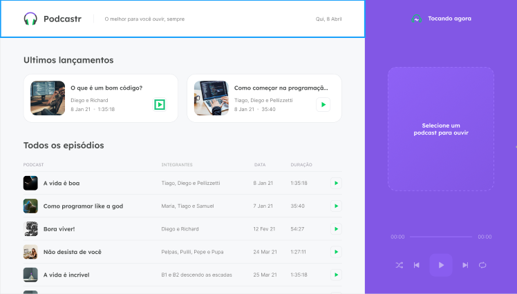
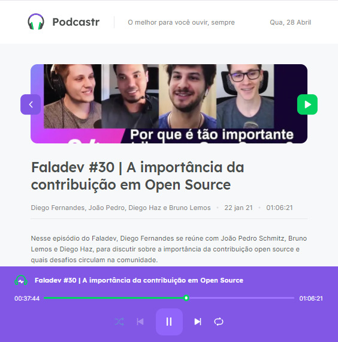
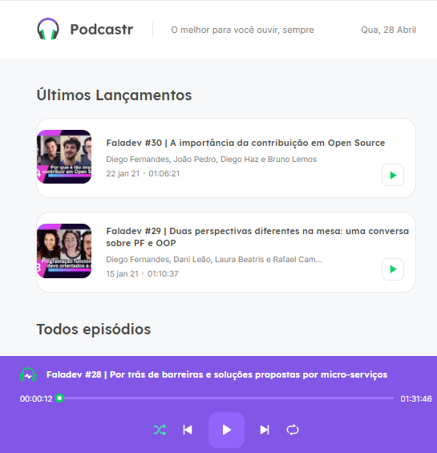

<h1 align="center">
    
    <span align="center">Podcastr</span>
</h1>

<p align="center">
    <a href="#headphones-about">About</a> •
    <a href="#computer-layout">Layout</a> •
    <a href="#rocket-getting-started">Getting Started</a> • 
    <a href="#microscope-technologies">Technologies</a> • 
    <a href="#pencil2-author">Author</a> • 
    <a href="#pencil-license">License</a>
</p>

## :headphones: About

Podcastr is a platform for podcast broadcasting

This is a project developed during the **[Next Level Week](https://nextlevelweek.com/)**, presented by **[@Rocketseat](https://github.com/Rocketseat)**.

---

## :computer: Layout

You can view the project layout through the links below:

- [Layout Web](https://www.figma.com/file/UwFEntsHpHYJlHNQAQr4gA/Podcastr?node-id=160%3A2761) 

Remembering that you need to have a [Figma](http://figma.com/) account to access it.

### :globe_with_meridians: Web

<p align="center">
  

  
</p>

### :iphone: Web Mobile

<p align="center" style="display: flex; align-items: flex-start; justify-content: center;">
  

  
</p>

---

## :rocket: Getting Started

### Requirements

- You need to install both [Node.js](https://nodejs.org/en/download/) and [Yarn](https://yarnpkg.com/) to run this project.

**Clone the project and access the folder**

```bash
$ git clone https://github.com/FabioRamos12/podcastr.git && cd podcastr
```

**Follow the steps below**

```bash
# Install the dependencies
$ yarn

# Run the backend fake server
$ yarn server

# Run the web server
$ yarn dev
```

The app will be available for access on your browser at `http://localhost:3000`

---

## :microscope: Technologies

This project was developed using the following technologies:

- [Next.js](https://nextjs.org/)
- [React](https://reactjs.org)
- [TypeScript](https://www.typescriptlang.org/)

---

## :pencil2: Author

 
 <span>Fabio Ramos</span>

[](https://www.linkedin.com/in/fabioalvesramos/) 
[](mailto:fabioalvesramos12@gmail.com)

---

## :pencil: License

This project is under the license [MIT](./LICENSE).

---